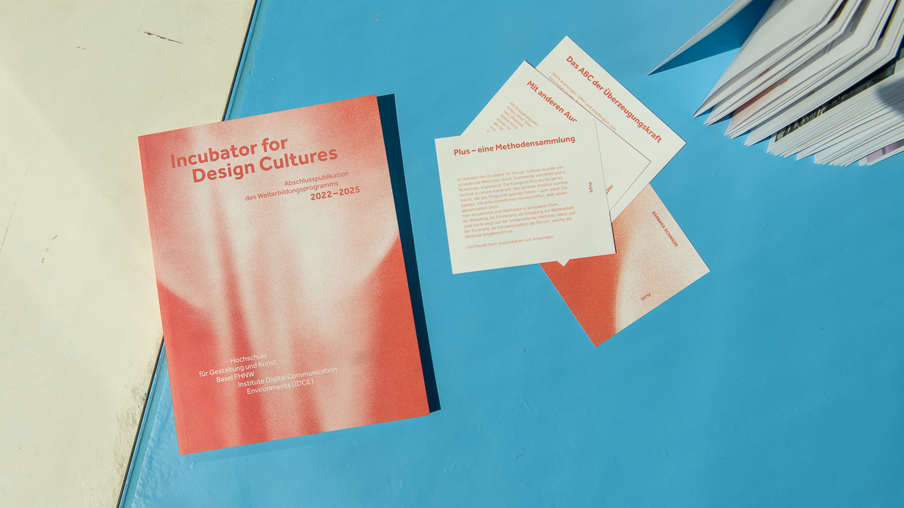

### [Educational Resources FHNW](https://www.fhnw.ch/de/gestaltung-kunst/ueber-uns/campus/mediathek/educational-resources) 

 

  

 

**Educational Resources** sind Materialien, Informationen und Daten, die für Lehre, Lernen und Vermittlung genutzt werden können. Dazu gehören zum Beispiel Lehrmaterialien, Anleitungen, Texte, Bilder, Videos, Datensammlungen oder digitale Werkzeuge. 

 

Auch ausgewählte Ergebnisse aus Lehre und Forschung der HGK Basel FHNW können als Educational Resources genutzt werden. Sie unterstützen den Wissenstransfer und können für Unterricht, Studium, selbstständiges Lernen oder die Vermittlung eingesetzt werden. 

 

Entdecken Sie die Educational Resources der Mediathek im [**Integrierten Katalog der Mediathek**](https://ink3.sammlung.cc/de)
 

 

### Zu den öffentlich einsehbaren Sammlungen gehören: 

- Incubator for Design Cultures 

- Die Interviews zum Feministisches Impovisatorium 

- Die Interviews zur Medienkultur Digital Brainstorming 

- Videowochen im Wenkenpark 

- Die Inhalte des Performance Portals  

 

Die geschlossenen Sammlungen für die hochschul-interne Nutzung werden hier nicht separat ausgewiesen.