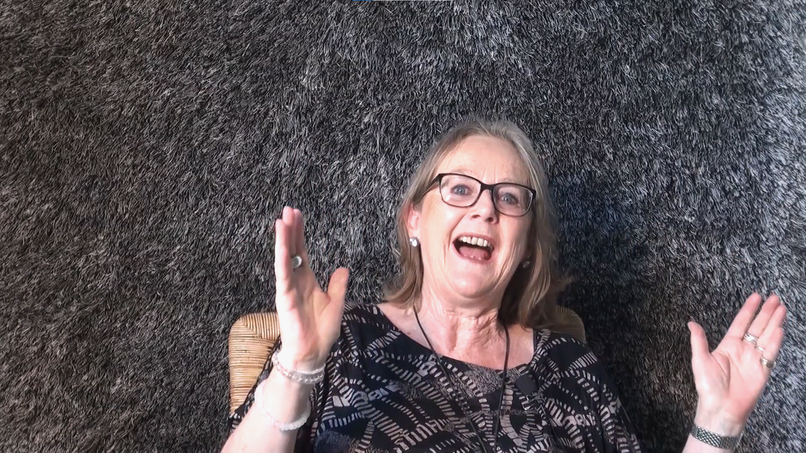

Dank des offenen Sammlungsprofils können wir kunst-, design- und kulturhistorisch relevante digitale Sammlungen externer Stakeholder aufnehmen, wenn wir diese oder Teile daraus öffentliche zugänglich machen können.  

Zu diesen Inhalten gehören z. B. 

- Die Interviews der Serie Digital Brainstorming von Dominic Landwehr (ehem. Migros Kulturprozent) 

- Die Interviews des Feministischem Improvisatorium, die von Muda Mathis, Chris Regn und Lysann König Anlässlich des 50jährigen Jubiläums des Jahrs 1968 realisiert wurden 

- Eine Auswahl an künstlerischen Beiträgen zur «Summe 2017» 

- Sowie weitere Inhalte und Quellen. 