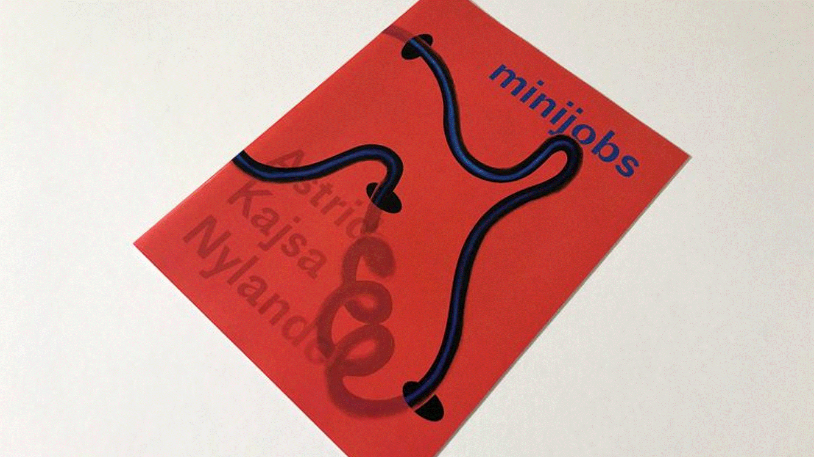

[Kreative Publikationsformen und Kollaboration](https://www.fhnw.ch/de/gestaltung-kunst/ueber-uns/campus/mediathek/kollaborative-publikationen)

  

 
Im Bereich der kreativen Publikationsformen arbeiten wir mit kleinen Verlagen von Künstler:innen, Kollektiven und Gruppen zusammen, um schwer zugängliche, digitale Publikationsformen nachhaltig zu sichern. 

Neben ePubs, die im InK direkt dargestellt werden archivieren wir Webseiten.  

Auch wenn dieser Arbeitsbereich derzeit noch aufgebaut wird, sind schon diverse Quellen online verfügbar:   

- Einige Quellen sind im Swisscovery katalogisiert. Das verbessert die Auffindbarkeit. 

- Link Swisscovery: https://fhnw.swisscovery.slsp.ch/discovery/collectionDiscovery?vid=41SLSP_FNW:VU1&collectionId=8182193720005518&lang=de 

- Alle weiteren Inhalte finden sich hier im [InK](https://ink3.sammlung.cc/de). 