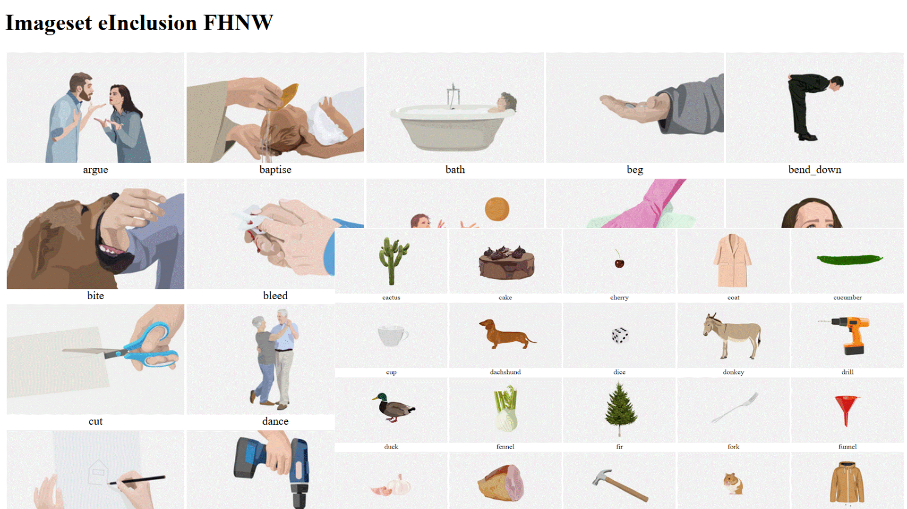

## [Practice Based Research](https://www.fhnw.ch/de/gestaltung-kunst/ueber-uns/campus/mediathek/forschungsresultate )

**Künstlerische und Designforschung** ist häufig interdisziplinär und verbindet unterschiedliche Menschen, Themen, Methoden und Formen des Arbeitens. Neben Texten und Daten entstehen dabei auch Bilder, Videos, Audioaufnahmen, Objekte, Prozesse oder andere experimentelle Formate. Forschungsergebnisse lassen sich deshalb nicht immer in klassischen Publikationsformen darstellen. 

 

Der **Integrierte Katalog** (InK) bietet eine Möglichkeit, solche Forschungsdaten und -publikationen der HGK Basel FHNW und ihrer Partner dauerhaft zu dokumentieren, zu veröffentlichen oder geschützt zugänglich zu machen. 

 

### Zu den im InK publizierten Forschungsdaten gehören:  

- Inhalte des Forschungsprojekts Plant Intelligence 

- Inhalte des Forschungsprojekts Cultural Spaces and Design 

- Inhalte der Forschungsprojekt Neztkulturen sowie Videokulturen 

- Inhalte der Konferenz Memory Full 

- Inhalte des Forschungsprojekts Peripher_ies 

- Inhalte des Forschungsprojekts SMUC Scaling Material Urban Commons 

- Inhalte des Forschungsprojekts Grenzgang 

- Die Datendokumentation zum Forschungsprojekt Cycles of Circulation 

- Sowie einige Forschungsdaten der Scuola Cantorium Basiliensis der HSM FHNW Basel und deren selbst herausgegebene Open Access Publikationen 

 
