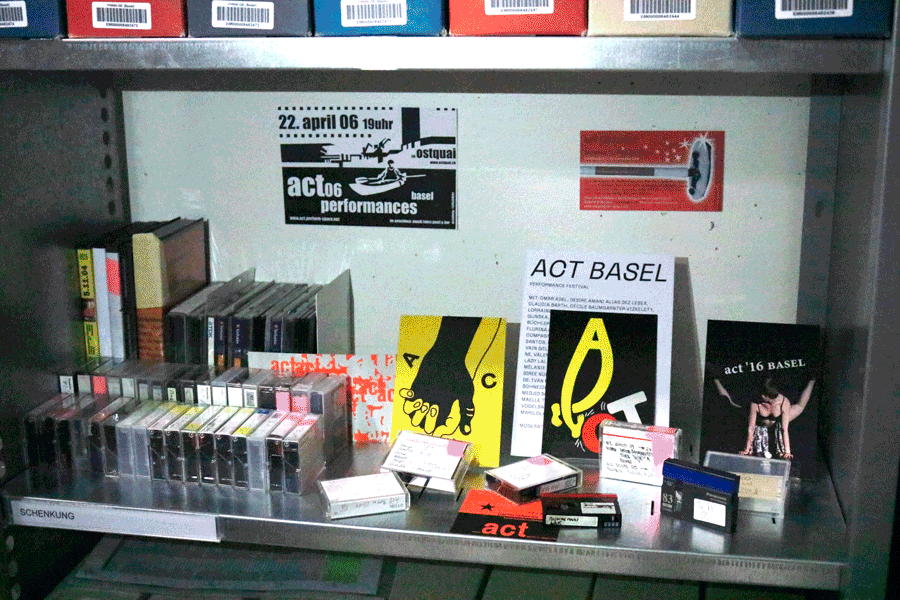

Die Anfänge der **Videokunst und -kultur** sind eng mit Basel und seiner Kunsthochschule verbunden. Bereits an der damaligen Schule für Gestaltung wurden Film- und Videotechniken unterrichtet. Daraus entstand eine Videofachklasse, die später an der neu gegründeten HGK Basel weitergeführt wurde. 

 

Zur Basler Videokultur gehört auch die gemeinschaftliche Zusammenarbeit und Selbstorganisation, etwa in Genossenschaften. 

 

Die enge Verbindung zur Hochschule zeigt sich bis heute auch in der Mediathek. Sie verwaltet verschiedene Videosammlungen des Instituts Kunst und der HGK Basel. Viele dieser Werke können öffentlich zugänglich gemacht werden. 

 

Zu den frei zugänglichen Sammlungen gehören: 

- Die Dokumentation der sog. Videowochen im Wenkenpark (1984 / 1986 / 1988) 

- Die Sammlung Film + Design () 

- Dokumentation von Videocity.BS (Teil 1) – als Videokunst im Öffentlichen Raum 

- Ein Grossteil der Videoprojekte und -produktionen der Videogenossenschaft Basel (Point de Vue) 

- Rechercheprojekte zur Video und Netzkultur in Basel 

- Und weitere Projekte, die sowohl der Videokunst und -kultur aber auch andern Gattungen zugeordnet werden können 
