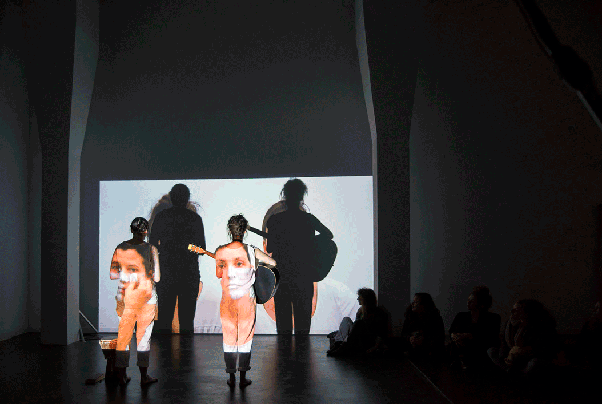

## Das studentisch organisierte Performance-Festival der Schweizer Kunsthochschulen

Act versteht sich als offenes Laboratorium zur Erprobung performativer Projekte und künstlerischer Strategien. Das Fes-tival bietet seit 2003 eine Plattform für Kunststudierende an Schweizerischen Hochschulen. Es findet jeweils verteilt in Basel, Bern, Genf, und Zürich, sowie abwechselnd in Luzern und Sierre statt. Aus der ganzen Schweiz reisen die Stu-dierenden jeweils an einen Austragungsort, wo sie sich gemeinsam und konzentriert ihrer künstlerischen Praxis widmen und dabei ihre performativen Strategien oder Werke weiterentwickeln.
Das Festival ist weitgehend von Studierenden organisiert, sodass die Teilnehmenden die unterschiedlichen Kulturen und Gegebenheiten der Hochschulen, Austragungsorte und natürlich auch der anderen Studierenden kennenlernen. Sie treten aus dem eigenen Umfeld heraus und erweitern ihren Horizont, da Performancekunst immer auch auf die lokalen Strukturen rea-giert und zum Gegenstand der jeweiligen Arbeiten macht.

Die Sammlung ACT Basel (2004-2018) enthält über 500 Arbeiten von über mehr als 300 Künstlerinnen und/oder Künstlergrup-pen. Den Kernbestand der Sammlung - ca.14.000 Medien Video-, Bild-, Ton- und Textmaterialien- hat Muda Mathis zusammen-getragen; die initiale Aufarbeitung erfolgte durch Marc Norbert Hörler 2018/2019.

Der Schwerpunkt der Dokumentationsmaterialien ruht auf den Basler Festivalausgaben sowie den Werkbeiträgen von Basler Studierenden, die häufig auch an anderen Standorten, also in Bern, Genf, Luzern/Sierre oder Zürich aufgeführt wurden. Da ACT jedoch ein vernetztes Festival ist, finden sich häufig auch die Werkbeiträge der Studierenden von anderen (Hoch-)Schulen sowie Werkbeiträge externer Studierender.

Aufgrund der Rechtesituation kann die Sammlung derzeit nur im Schweizer Hochschulnetz konsultiert werden.

## Recherche
Bestand ansehen

