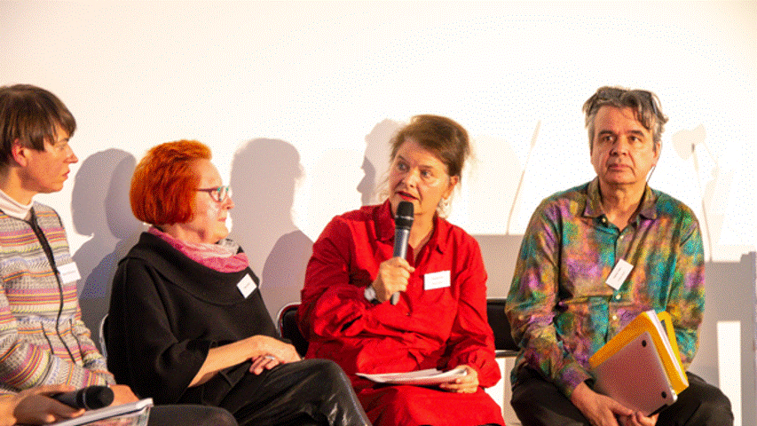

## Relikte eines kulturpolitischen Projekts zur Archivierung von Performance Kunst

Die Sammlung enthält Prozessunterlagen (Fotos) und Dokumentationen des Projektes "Archive des Ephemeren". 
Unterstützt vom Bundesamt für Kultur, der Burgergemeinde, der Stadt und dem Kanton Bern, der Stiftung Corymbo, der H.E.M. Stiftung und der Scherbarth Stiftung, wurde es zwischen Herbst 2017 und Sommer 2019 realisiert, um eine gesellschaftliche Debatte zur Archivierung und Überlieferung der Performancekunst zu lancieren.
Getragen von [PANCH - Performance Art Network CH](https://panch.li/2018-2019archive-des-ephemeren/) wurden fünf sog. Denkpools zu thematischen Schwerpunkten mit Künstler:innen, Expert:innen aus unterschiedlichen kulturellen Bereichen sowie der interessierten Öffentlichkeit realisiert. 
Dabei wurde die künstlerische Sicht auf das Archiv auf Augenhöhe mit theoretischen Ansätzen diskutiert und das Archiv "von unten" als etwas "lebendiges" gedacht.

## Denkpools
I: [Digitale Plattformen und Datenbanken](../../detail/zotero2-2317722.F8KYBHNT)

II: [Archive des Ephemeren und Policies](../../detail/zotero2-2317722.HTBXHIXI)

III: [Wilde Archive](../../detail/zotero2-2317722.4YV23KGF)

IV: [Symposium ](../../detail/zotero2-2317722.XDR8B65R)

V: [Projektauswertung und kulturpolitische Strategie](../../detail/zotero2-2317722.888RBU88)

[Broschüre Deutsch](https://hdl.handle.net/20.500.11806/qr/ade_publ)
[Brochure English](https://hdl.handle.net/20.500.11806/qr/ade_publ_en)

## Präsentationen beim Symposium

[Barbara Büscher](../../detail/zotero2-2317722.2BT8FNXS) |
[Nicolas Brulhart](../../detail/zotero2-2317722.ZIIGZ4EU) |
[Annet Dekker](../../detail/zotero2-2317722.5DGJNZVW) |
[Antonia Erni](../../detail/zotero2-2317722.ZKUXPRXL) |
[Esther Ferrer](../../detail/zotero2-2317722.BZ6CD22L) |
[Sabine Folie](../../detail/zotero2-2317722.C4MTVT7Q) |
[Claudia Grimm](../../detail/zotero2-2317722.6VKVX4PL) |
[Daria Gusberti](../../detail/zotero2-2317722.LWXWVI9Z) |
[Hayley Newman & Bryan Reedy](../../detail/zotero2-2317722.2CZHURE5) |
[Boris Nieslony](../../detail/zotero2-2317722.9INNT87N) |
[Eleanor Roberts](../../detail/zotero2-2317722.QHSKRHEK) |
Dorota Sajewska |
[Sigrid Schade](../../detail/zotero2-2317722.UC75H7MU) |
[Beate Schlichenmaier](../../detail/zotero2-2317722.D5256GWS) |
[Dorothea Schürch](../../detail/zotero2-2317722.4JU6KXIL) |
[Walter Siegfried](../../detail/zotero2-2317722.5T9SS7JS) |
[Marlies Surtmann](../../detail/zotero2-2317722.PMYNSEE9) |
[Martha Wilson](../../detail/zotero2-2317722.5EFGCMGA) |
[Wen Yau](../../detail/zotero2-2317722.EY6B9FA7)

## Recherche
[Bestand ansehen](../../grid/de?searchtype=estate&search=Archive%20des%20Ephemeren)

