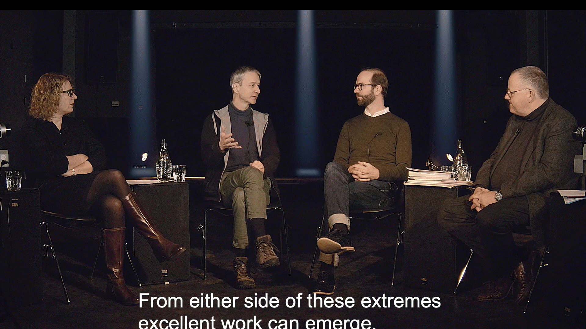

## Ein Projekt des Migros Cultural Project

Dem digitalen Wandel auf der Spur. Das war das Thema einer Veranstaltungsreihe, die das Migros-Kulturprozent im Jahr 1998 bis 2019 betrieb. Im Zentrum standen zunächst Veranstaltungen in verschiedenen Formaten, namentlich Performances, Vorträge und Workshop. Das Projekt Digital Brainstorming entwickelte sich im Lauf der Zeit zu einer eigentlichen Plattform und integrierte namentlich auch multimediale Elemente. Zwischen 1998 und 2019 entstanden rund 220 Audiopodcasts und 80 Videobeiträge. Sie beschäftigen sich mehrheitlich mit kulturellen Fragen und Projekten, die vom Migros-Kulturprozent während dieser Periode gefördert wurden. Der Schwerpunkt liegt dabei auf Schweizer Persönlichkeiten aus dem Bereich Kultur und Gesellschaft, aber auch Politik und Wissenschaft. Der enge Begriff der Medienkunst wurde im Lauf der Zeit durch den weiteren Begriff der digitalen Kultur ersetzt. Die Verantwortung für das Projekt Digital Brainstorming oblag in dieser Zeit dem Medien- und Kulturwissenschaftler Dominik Landwehr (*1958). Der Journalist hat 1983 ein Lizenziat (heute Master) an der Universität Zürich erworben und 2007 an der Universität Basel mit einer Arbeit zur Chiffriermaschine Enigma promoviert.
On the trail of digital change. This was the theme of a series of events, called Digital Brainstorming, run by the Migros Culture Percentage from 1998 to 2019. The initial focus was on events in various formats, namely performances, lectures and workshops. Over time, Digital Brainstorming developed from a project into an actual platform and integrated multimedia elements. Between 1998 and 2019, about 220 audio podcasts and 80 video segments were produced. Most of them deal with cultural issues and projects that were supported by the Migros Culture Percentage during this period. The focus is on Swiss personalities from the fields of culture and society, but also on politics and science. Over time, the narrow concept of media art has been replaced by the broader concept of digital culture.

During this time, the media and cultural scholar Dominik Landwehr (*1958) was responsible for Digital Brainstorming. The journalist obtained a Master's degree from the University of Zurich in 1983 and a doctorate from the University of Basel in 2007 with a thesis on the Enigma cipher machine.

[Gesamte Sammlung](https://mediathek.hgk.fhnw.ch/ink/detail/zotero2-2327162.WZUI32AD)

## Recherche
[Bestand ansehen](../../grid/de?searchtype=estate&search=DigitalBrainstorming)

