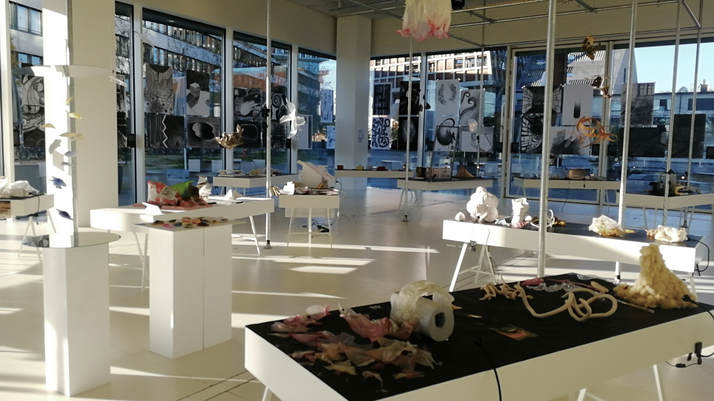

## Workshop Raum 

Die Sammlung beinhaltet studentische Arbeiten, die im Modul Erinnerungsraum des Studiengangs Innenarchitektur und Sze-nografie am ICDP der HGK Basel FHNW entstanden sind. Als kurzer Input für das jeweils erste Studienjahr verbindet das Modul das räumlich-imaginäre Denken der Teilnehmenden mit einem Kennenlernen der Werkstatt und den ästhetischen Quali-täten verschiedener Materialien. Zudem wird die eigene Dokumentationskompetenz gestärkt. Das Modul endet mit einer Aus-stellung der entstandenen Modelle und einer digitalen Publikation des Entstehungsprozesses.
Der Workshop Raum beginnt mit dem Analysieren eines ganz persönlichen Raumes, dem Erinnerungsraum. Dieser wird in Kon-text gebracht durch das Hinzufügen weiterer Räume (Raumsequenz) und das Betrachten ihrer Bezüge untereinander.
[Link zur Website](https://erinnerungsraum.in3.campusderkuenste.ch/)

Das Einfügen dieses persönlichen Raumes in ein öffentliches Gebäude eröffnet Fragen zu Massstab und neuen Raumbeziehun-gen. Ausgehend von dieser neuen Situation erforschen die Studierenden die Raumqualitäten und erkennen Aspekte der Raum-atmosphäre wie:
- Raumkomposition
- Wirkung von Licht und Materialität
- raumdefinierende Elemente
- Masse und Leerraum
- Raumstruktur

Deren Auswirkung auf die Raumwahrnehmung wird erforscht und hinterfragt und dient als Entwurfsgrundlage für eine Raumintervention. Ziel der Übung ist es, ein Gleichgewicht von Intuition und Analyse herzustellen, welches innovative Räume mit Atmosphäre (Seele) kreiert.
Das Archiv dokumentiert die Arbeiten der Studierenden ab dem Jahrgang 2013:

- [2025](https://erinnerungsraum.in3.campusderkuenste.ch/2025/programm/)
- [2024](https://erinnerungsraum.in3.campusderkuenste.ch/2024/programm/)
- [2023](https://erinnerungsraum.in3.campusderkuenste.ch/2023/programm/)
- [2022](https://erinnerungsraum.in3.campusderkuenste.ch/2022/programm/)
- [2021](https://erinnerungsraum.in3.campusderkuenste.ch/2021/programm/)
- [2020](https://erinnerungsraum.in3.campusderkuenste.ch/2020/programm/)
- [2019](https://erinnerungsraum.in3.campusderkuenste.ch/2019/programm/)
- [2018](https://erinnerungsraum.in3.campusderkuenste.ch/2018/programm/)
- [2017](https://erinnerungsraum.in3.campusderkuenste.ch/2017/programm/)
- [2016](https://erinnerungsraum.in3.campusderkuenste.ch/2016/programm/)
- [2015](https://erinnerungsraum.in3.campusderkuenste.ch/2015/programm/)
- [2014](https://erinnerungsraum.in3.campusderkuenste.ch/2014/programm/)
- [2013](https://erinnerungsraum.in3.campusderkuenste.ch/2013/programm/)

## Recherche
[Bestand ansehen](../../grid/de?searchtype=estate&search=Erinnerungsraum)

