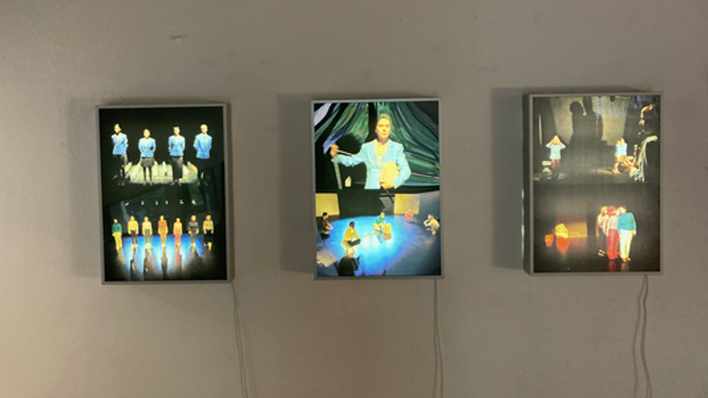
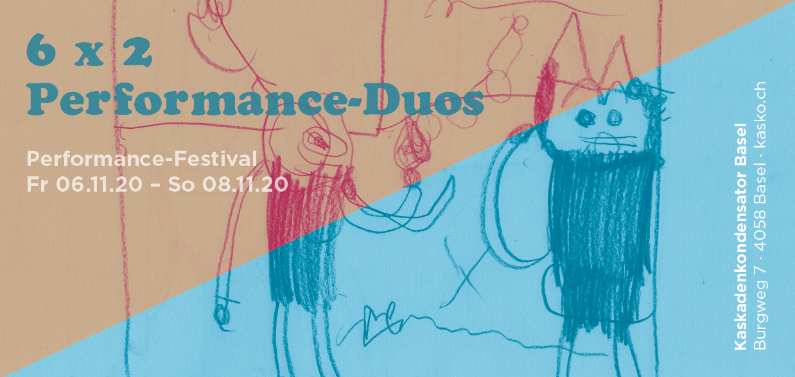
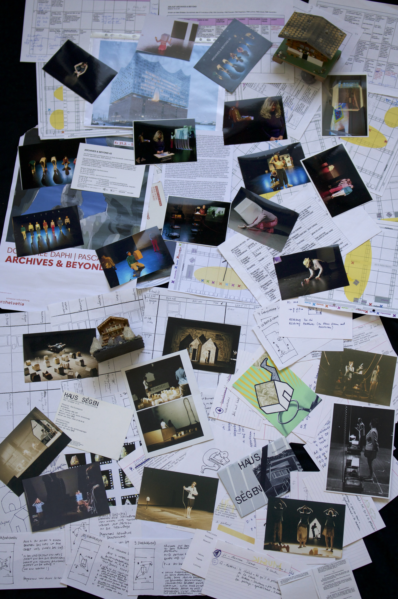
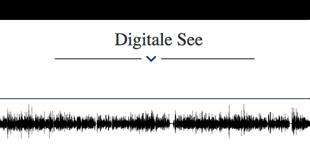
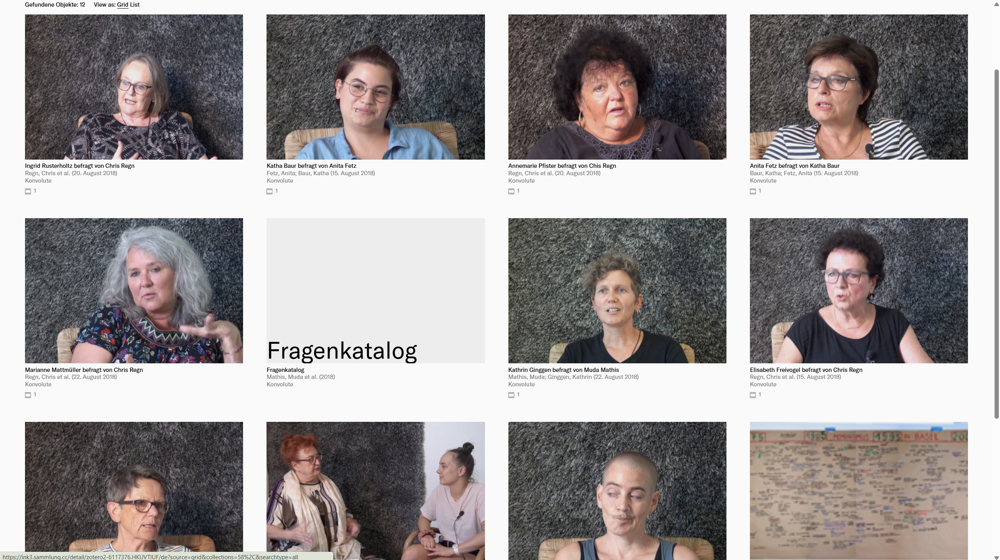

---
Title: Konvolute
Type: estate
CollectionTitle: Konvolute
Docs: 191
---

Die Konvolute oder kleine Sammlungen enthalten Dokumentationen, Beschreibungen und Wer-ke, die meist projektbasiert entstanden sind. Zu den Konvoluten gehören die Teilbestände:

| 6x2 Performance Duos   | ARCHIVES & BEYOND   | Radiosendungen     | Feministisches Improvistatorium |
|:----------------------:|:-------------------:|:------------------:|:-------------------------------:|
|       |    | | |

- [**6x2 Performance Duos**]() – Ein von Pascale Grau kuratiertes Performanceprojekt im KASKO 2020 mit Performances sowie umfangreichen Reflexionen.
- [**ARCHIVES & BEYOND**]() – Ein von Pascale Grau und Dorothee Daphi kuratiertes, kollaborative Performanceprojekt zur Wiederaufführung des Stücks HAUSS(a)EGEN.

- Sowie die beiden Teilbestände der **Digialen See**: 
    - Interviews des [**Feministischen Improvisatoriums**]() zu 50 Jahren 1968
    - Zu den [**Radiosendungen**]() – Texte aus dem Dunstkreis
