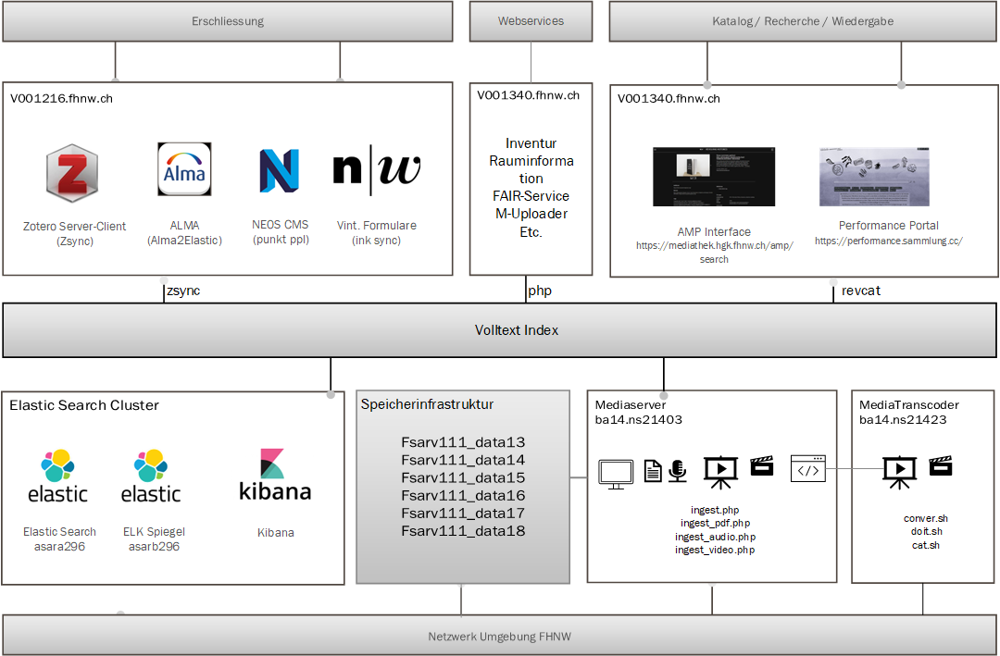

---
Title: InK-System
Type: info
CollectionTitle:
Docs: 
--- 

Der Integrierte Katalog (InK) ist das Katalogsystem für die digitalen Sammlungen der Hochschule für Gestaltung und Kunst FHNW Basel. Neben hochschulinterne Quellen aus der Lehre und Forschung verwaltet der InK umfangreiche Spezialsammlungen mit externen Quellen zur Gegenwartskunst und -kultur. [[Leistungsauftrag](https://minio.campusderkuenste.ch/med-public/InK_Leistungsauftrag.pdf), [Policy](https://minio.campusderkuenste.ch/med-public/15_OA-Policy_de_20231128_signed_CP.pdf)]

Als Repositorium einer Kunsthochschul sind die visuelle Aufbereitung der Sammlungsinhalte und die Kontextualisierung der oft komplexen digitalen Daten besonders wichtig. Daher kommt den Darstellungs- und Rechercheoberflächen eine besondere Rolle im InK zu. Zum Verlangen nach Sichtbarkeit und Zugänglichkeit der jeweiligen Medien kommt der Wunsch nach Dauerhaftigkeit und Persistenz hinzu, weshalb die FAIR-Principles als Richtlinie der Services und Technologien gelten.

Als forschungsnahes Angebot der Mediathek ist der InK in beiden Verzeichnissen [re3data](https://www.re3data.org/repository/r3d100014291) und
[openDOAR](https://opendoar.ac.uk/repository/10880) anerkannt und gelistet.

### System, Hosting, Maintenance

Technisch ist der InK als modular MACH-Architektur aufgebaut. Das bedeutet:

- M für Microservices  
Die Microservices des InK sind leicht erweiterbar.
- A für API First  
Die systeminterne Kommunikation erfolgt primär über standardisierte Schnittstellen.
- C für cloudbased  
Der InK ist eine Could-Ressource innerhalb der FHNW Infrastrukturen, deren Komponenten cloudfähig sind.
- H für Headless  
Der Katalogteil des InK ist headless. Damit lassen sich Nutzerinterfaces an spezifische Interessen oder Anforderungen angepassten, ohne die Qualität und Nachhaltigkeit der Datenbasis zu tangieren.  

Die wichtigsten Systemkomponenten des InK sind:

- Mediaserver
    Die Vereinnahmung, Transcodierung und Auslieferung der Medien erfolgt über einen Opensource Microservice Mediaserver.
- Speichersystem
    Die Aufbewahrung der eingebrachten Medien erfolgt über die Speicherinfrastruktur der FHNW.
- Volltextindex
    Die Verwaltung der Metadaten und der Medienreferenzen erfolgt über ElasticSearch. Für Statistiken und Datenanalysen wird Kibana verwendet.
- Webanwendungen & Zugangsschicht(en)
    Spezialisierte Webanwendungen ermöglichen den Zugang und die Darstellung der Daten und ihrer Beschreibungen. Dazu gehören:
    - Katalogansichten mit Suchinterfaces
    - Formularsysteme zur Erschliessung
    - diverse MySQL, PostgreSQL und MariaDB-Datenbankserver zur Verwaltung der vereinnahmten Inhalte, der Berechtigungen und der Kuratierungs-Workflows der Mediathek, der hinterlegten Listen sowie der Inventur- und Rauminformationssysteme der Mediathek
    - Zsync zur Synchronisation von Metadaten aus externen Systemen (Zotero, Inventursuiote) 
    - Sog. FAIR-Service zur Vergabe und Verwaltung von PIDs, der OAI-PMH-Schnittstelle sowie einem reduzierten Datenabzug, der als FAIRes Notfall-Szenario für den InK.

Grafisch lassen sich die InK-Systemkomponenten wie folgt schematisieren:

### Organisatorische Rahmen

- Product Ownership: Leitung Mediathek
- Systemadministration & Betrieb: Punkt GmbH
- Hosting & Technische Infrastrukturen FHNW: Corporate IT, Campus IT HGK Basel FHNW
- Operative Schnittstellen CIT FHWN: Campus IT HGK Basel FHNW

### Kontakt

Für inhaltliche Fragen und Korrekturwünsche ist die Mediathek der HGK Basel FHNW zuständig.
Sie beantwortet auch technische Fragen und Fragen zur Plattform.

[Sucheinstieg](https://mediathek.hgk.fhnw.ch/ink/search)
