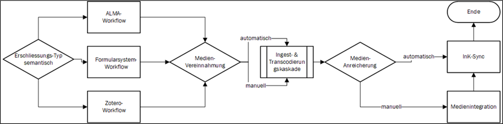
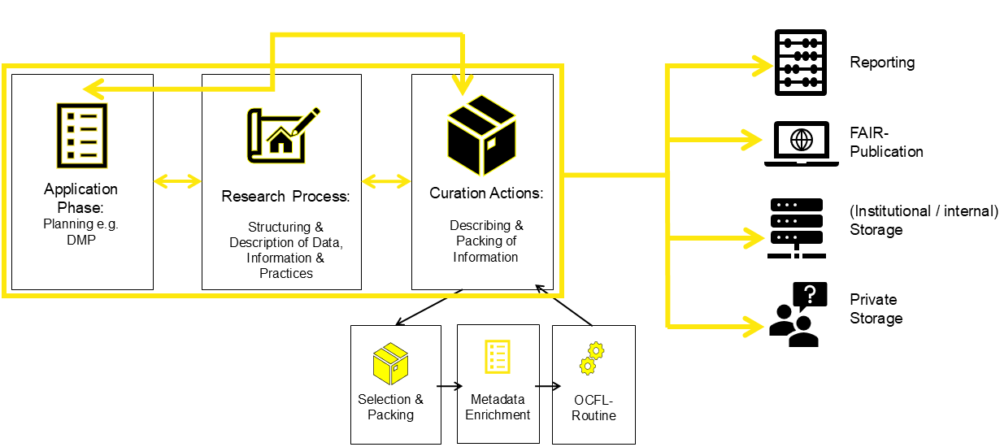
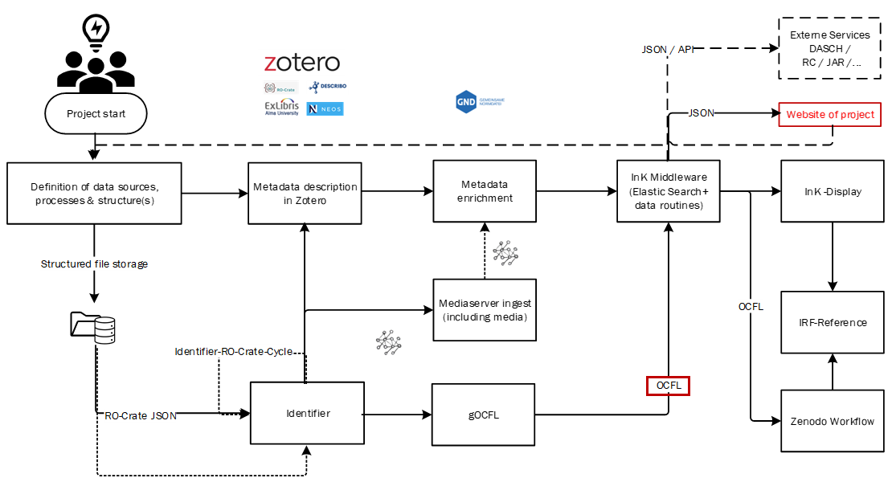

---
Title: InK-Workflows
Type: estate
CollectionTitle: InK-Workflows
Docs: 
--- 

## Standardworkflows

Die Mediathek kontrolliert und organisiert einen Grossteil der operativen Prozesse zur Erfassung, Vereinnahmung, Publikation und Speicherung der digitalen Quellen (inkl. Beschreibung). Die Standardworkflows sind intern dokumentiert und werden den betroffenen Mitarbeitenden, Dienstleistenden sowie auf Anfrage zugänglich gemacht. Gleiches gilt für Schulungsmassnahmen.
Wo dies erforderlich ist, werden Prozesse auf ihre Bedürfnisse angepasst.

Zu den wichtigsten Standardworkflows gehören: 

- **Erschliessung**
    Die Erschliessung der Sonderbestände erfolgt i.d.R. mithilfe eines spezifischen Zotero-Clients sowie einem für die Mediathek angepassten NEOs-Formularsystem.
    Hinzu kommt die Erschliessungsoption via Bibliothekssystem ALMA, welche insb. für die Normdatenanreicherung von Bedeutung ist.

-  **Medienvereinnahmung**
    Bei der Medienvereinnahmung wird für jede Datei zunächst ein Datenbankeintrag erzeugt, der die Datei einer bestimmten Sammlung zuweist. Weitere technische sowie semantische Informationen werden durch die folgenden Bearbeitungsschritte weitgehend automatisiert angereichert. Bei Medien, die nicht im Zuge eines Uploads automatisiert in einen beschreibenden Metadatensatz referenziert wurden, erfolgt zuletzt die Verknüpfung.

- **Synchronisation & FAIR-Service**
    Diverse Synchronisationsskripte übermitteln die Inhalte der Erschliessungs- und Verwaltungssysteme and den Volltextservice, der die Inhalte wiederum über die Katalogoberflächen ausspielt.
    Dabei findet teilweise eine automatisierte Anreicherung der Daten statt.

- **FDM Support / Unterstützung im Umgang mit Forschungsdaten**
    Das Forschungsdatenmanagement (FDM) fokussiert auf Kuratierungshandlungen, die als integraler Bestandteil des Forschungsprojektes sowie an dessen Ende besonders deutlich spürbar sind.

Die Mediathek unterstützt mit sinnvollen Open-Source-Werkzeugen sowie Schulungen:

- Hinweise zu nützlichen Tools und Ablageorten:
    - Github: https://github.com
    - Zotero: https://www.zotero.org/
    - gOCFL: https://github.com/ocfl-archive/gocfl
    - Idexer for File identifcation and elimination of duplicated files: https://github.com/je4/indexer
    - RO-Crate-Beschreibungstools: https://www.researchobject.org/ro-crate/tools

- Schulungen / Workflows zu:  
    - Einsatz von Zotero 
    - Beschreibung von Forschungsdaten mit OR-Crate 
    - gOCFL nutzen und anwenden Lernen

### Weitere interne Workflows

- Rauminformation und Inventursuite: [3D-Modell](https://mediathek.hgk.fhnw.ch/3d.php), [Kistentool](https://mediathek.hgk.fhnw.ch/kistentool.php), [PrimoBridge](https://mediathek.hgk.fhnw.ch/nebis/viewer?sys=00-00), sowie weitere Informationen auf Anfrage
- FDM-Workflow zur Dokumentation von Rohdaten auf Zenodo

