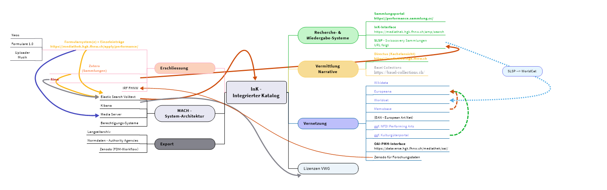

Der InK integriert nicht nur unterschiedliche Datenquellen aus verschiedenen Kontexten und variierenden Erschliessungssystemen. Er integriert sich auch in eine breite wissenschaftliche und kulturelle Landschaft. Dabei können eher wissenschaftliche von stärker kulturell- und sammlungsstrategisch ausgerichtete sowie Community-basierte Ökosysteme unterschieden werden.

### InK Ökosystem

Vereinfacht lässt sich diese strukturelle Ausrichtung wie folgt charakterisieren:

Zu den unterschiedlichen Erschliessungswegen (inkl. Interfaces, s.o.) kommen diverse Schnittstellen zu Katalogs- und Recherchesystemen sowie eine öffentliche OAI-PMH-Schnittstelle hinzu, welche die FAIR publizierten Inhalte des InK über definierte Datensetzs zugänglich macht.

### Katalog- und Recherchesysteme

Zu den Katalog- und Recherchesystemen gehören neben der eigenen

- InK-Recherche- und Wiedergabeoberfläche: https://mediathek.hgk.fhnw.ch/amp/search

- und dem Sammlungsportal: https://mediathek.hgk.fhnw.ch/amp/collections

die Recherchesysteme externer Stakeholder:

- das Institutionelle Repositorium für Forschungspublikationen der FHNW: [IRF](https://irf.fhnw.ch/home)

- das Bibliotheksportal Swisscovery von SLSP: [FHNW (slsp.ch)](https://fhnw.swisscovery.slsp.ch/discovery/search?vid=41SLSP_FNW:TEST)

- dem Sammlungsportal der Performance Sammlungen: https://performance.sammlung.cc/

### Vermittlungsinterfaces

Sucheinstiege mit Vermittlungscharakter sind neben der Sammlungsübersicht von SLSP

- Vorschau: [Hochschule für Gestaltung und Kunst Basel FHNW - FHNW (slsp.ch)](https://fhnw.swisscovery.slsp.ch/discovery/collectionDiscovery?vid=41SLSP_FNW:TEST&collectionId=8165366210005518&lang=de)

insb. die beiden Portale

- der Mediathek (Directus / Kachelansicht): https://mediathek.hgk.fhnw.ch

- von Basel Collections: https://basel-collections.ch/

### Vernetzung

Strategisch wichtig ist zudem die Vernetzung mit weiteren bestehenden Partnern und Angeboten. Zum implizit über das Rechercheinterface sowie das Sammlungsportal von SLSP (s.o.) benannten Service kommen folgende Stakeholder für selektive Datenabzüge und/oder Einträge hinzu:

- [Wikidata](https://www.wikidata.org/wiki/Wikidata:Main_Page)

- Memobase: [FHNW Hochschule für Gestaltung und Kunst Mediathek | MEMOBASE von Memoriav](https://memobase.ch/de/institution/hgk?term=mediathek&context=institutions&position=0)

- [Worldcat](https://search.worldcat.org/de)

- über SLSP - Swisscovery Sammlungen

    - OAI-PMH-Interface: https://dataverse.hgk.fhnw.ch/mediathek/oai/
